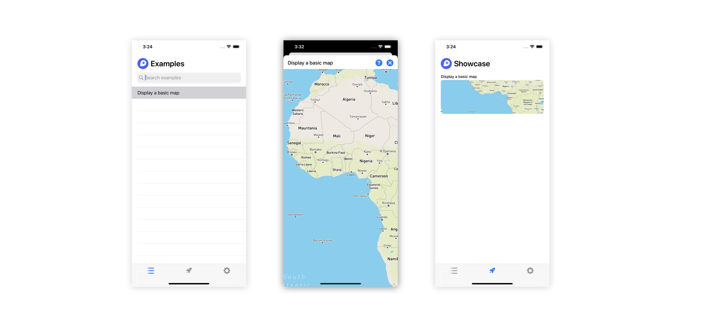

# Maps SDK Examples

Welcome! This sample application is intended to showcase different ways you can use v10.0.0+ versions of the Mapbox Maps SDK for iOS, which now runs on [Metal](https://developer.apple.com/metal/).



## Running this project

**Requirements:**
* Xcode 12
* A Mapbox access token, retrieved from your [Mapbox account dashboard](https://account.mapbox.com/access-tokens).

**Project setup:**

After cloning or downloading this repository, open the `MapboxMaps.xcworkspace` Xcode workspace file. This contains all of the example code related to the Maps SDK for iOS. Then, add a new entry to the `Info.plist` file within the `Examples` target, where the key is `MGLMapboxAccessToken`, and the value is your Mapbox access token.

_Note:_
If you plan on contributing to this project, it is recommended that you hide your access token from the `Info.plist` file. [Follow these steps](https://docs.mapbox.com/help/troubleshooting/private-access-token-android-and-ios/#ios) to include your access token using a build script as an alternative.

When you're finished, run the `Examples` target to launch the application.

## Contributing to examples

**Guidelines**

Before you begin creating a new example, first make sure there isn't an already similar one. We value quality over quantity, we welcome alterations to existing examples if that makes more sense than adding a new one. 

If you don't see a desired use case well explained by an example, you can contribute to a new one. New examples should strive to be:

* **Concise.** An example that is hundreds of lines long can be hard to quickly understand.
* **Self-contained.** Examples in this project shouldn't rely on any third party dependencies.
* **Useful to others.** An example's purpose should be broad enough to help out many other developers.

**Adding new examples**

To add a new example, go through the following steps:

1) Create a new `UIViewController` in the `Example/All Examples`. The file name should be the name of your example appended by the word `Example`, typed in the [camel case](https://en.wikipedia.org/wiki/Camel_case) style. For instance, if we're adding a new example to show how to download an offline map, the example file would be called `OfflineMapExample`.

Within this new `UIViewController` file, paste the following boilerplate code to import the dependencies needed to make the example work:

```swift
import UIKit
import MapboxMaps
import MapboxCoreMaps
import MapboxCommon

@objc(OfflineMapExample) // This must refer to the file name

public class OfflineMapExample: UIViewController, ExampleProtocol {

    override public func viewDidLoad() {
        super.viewDidLoad()
    }
    
    // Allows the delegate to receive information about map events.
    mapView.on(.mapLoadingFinished) { [weak self] _ in
        guard let self = self else { return }
        self.finish() // Needed for internal testing purposes.
    }
}
```

2) In `Models/Examples.swift`, add a new `Example` entry into the `Examples.all` array, as illustrated below. 

```swift
Example(title: "Download an offline map", 
        description: "Download a map offline for use without a network connection.", 
        type: "OfflineMapExample.self")
```

Note: The title you supply here will be displayed in the navigation bar of the app, so ensure to keep the title short. You can always highlight more about the example in the description, which appears as an alert when the user taps the `Info` button on the rop right corner of the navigation bar.

3) At this point, the example file has been fully configured to work with the project. You can now customize the code in your example file! Once you've finished, **[submit a pull request here](https://github.com/Mapbox/mapbox-maps-ios/compare/main...main?expand=1&template=example-pull-request-template.md)**. We look forward to seeing your contributions!