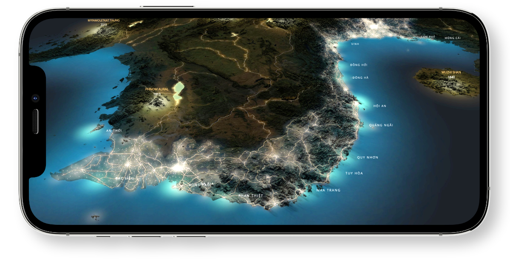

## Mapbox Maps SDK v10 for iOS

[](https://circleci.com/gh/mapbox/mapbox-maps-ios) [](https://codecov.io/gh/mapbox/mapbox-maps-ios) [](https://github.com/mapbox/secret-shield/blob/main/docs/enabledBadge.md)




The Mapbox Maps SDK for iOS is an open source library for displaying interactive, thoroughly customizable maps in native iOS. It is powered by vector tiles and Metal.

### Historical note

This repository is a continuation of the Mapbox Maps SDK available at [mapbox/mapbox-gl-native-ios](https://github.com/mapbox/mapbox-gl-native-ios) with a few important differences:

- The Legacy SDK is still maintained by Mapbox to address bug fixes and security vulnerabilities. However, new features like Metal support are only implemented in this repository (`mapbox-maps-ios`).
- Unlike the Legacy SDK, the Maps SDK in this repository has been rearchitected from scratch with modularity in mind. This allows removing or replacing functionality both at build and at run time, and saving on app size.
- In both cases, ObjC bindings are provided to interact with the [native renderer](https://github.com/mapbox/mapbox-gl-native). The Maps SDK v10 benefits from an automatic code generator developed by Mapbox, which provides clean, idiomatic APIs and ensures consistency with best practices across platforms.

Read [the announcement](https://github.com/mapbox/mapbox-gl-native/issues/15971) for more information.

## Getting Started

This README is intended for developers who are interesting in contributing to the Mapbox Maps SDK for iOS. Please visit https://docs.mapbox.com/ios/maps/overview for general information and instructions on using the Maps SDK in your iOS application.

### Setup environment

This project runs on Apple's Metal rendering framework. Prerequisites for running the test app in simulators:
- Install macOS 10.15 or later.
- Install Xcode 11 or later.

This project requires Carthage v0.35.0 or later (and a valid ~/.netrc file) to fetch dependencies. 

This project uses [SwiftLint](https://github.com/realm/SwiftLint) to enforce a style guide. Make sure you have this installed with `brew install swiftlint` before running in Xcode, otherwise you'll get an error. 

This project uses [secret-shield](https://github.com/mapbox/secret-shield) to help block secrets such as access tokens from being exposed. Install `secret-shield` by entering `npm install -g @mapbox/secret-shield`. Install the pre-commit hook by running `scripts/install-pre-commit/install-pre-commit.sh`

### Accessing the Maps SDK's source

Clone the git repository:

```
git clone git@github.com:mapbox/mapbox-maps-ios.git && cd mapbox-maps-ios
```

### Building the Maps SDK

Pre-requisite: Valid `.netrc` file located on your machine at `~/.netrc`, as instructed in the Getting Started section above. 

After cloning the repo, run `make deps` from the root folder to populate the Gl-native-internal and MapboxCommon dependencies.

Once complete, you can open `MapboxMaps.xcworkspace` and build any of the targets.
In order to use the test app, build and run the `DebugApp` target.

### Configuring the Maps SDK

You must provide a Mapbox access token to display Mapbox-hosted maps in the `DebugApp` test application. Add your Mapbox token to the `MGLMapboxAccessToken` key in `DebugApp/DebugApp/Info.plist`
