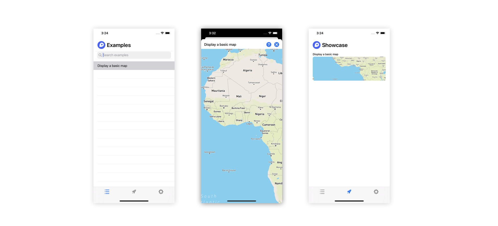

# Maps SDK Examples

Welcome! This sample application is intended to showcase different ways you can
use Mapbox Maps SDK v10 for iOS, which now runs on
[Metal](https://developer.apple.com/metal/).



## Running this project

### Requirements

* Xcode 12
* A Mapbox account

### Project Setup

The Examples project needs to be able to access Mapbox services to install
dependencies and load maps. Follow the instructions in the docs to
[Configure credentials](https://docs.mapbox.com/ios/maps/guides/install/).

When you get to the "Configure your public token" step, you can optionally place
your public token in the file `~/.mapbox` instead of modifying the Example app's
`Info.plist`. A build phase will read the public token from that file and
populate it in the `Info.plist` of the built product. This helps to ensure that
your public token does not end up in any of your commits.

Next, open `Apps/Apps.xcworkspace` and select the Examples scheme to build and
run the Examples app.

## Contributing to Examples

### Guidelines

Before you begin creating a new example, first make sure there isn't an already
similar one. We value quality over quantity, we welcome alterations to existing
examples if that makes more sense than adding a new one.

If you don't see a desired use case well explained by an example, you can
contribute to a new one. New examples should strive to be:

* **Concise.** An example that is hundreds of lines long can be hard to quickly
  understand.
* **Self-contained.** Examples in this project shouldn't rely on any third party
  dependencies.
* **Useful to others.** An example's purpose should be broad enough to help out
  many other developers.

### Adding New Examples

To add a new example, go through the following steps:

1. Create a new `UIViewController` in the `Example/All Examples`. The file name
   should be the name of your example appended by the word `Example`, typed in
   the [camel case](https://en.wikipedia.org/wiki/Camel_case) style. For
   instance, if we're adding a new example to show how to download an offline
   map, the example file would be called `OfflineMapExample`.

   Within this new `UIViewController` file, paste the following boilerplate code
   to import the dependencies needed to make the example work:

   ```swift
   import UIKit
   import MapboxMaps
   import MapboxCoreMaps
   import MapboxCommon
      
   public class OfflineMapExample: UIViewController, ExampleProtocol {
   
       override public func viewDidLoad() {
           super.viewDidLoad()
       }
       
       // Allows the delegate to receive information about map events.
       mapView.on(.mapLoaded) { [weak self] _ in
           guard let self = self else { return }
           self.finish() // Needed for internal testing purposes.
       }
   }
   ```

2. In `Models/Examples.swift`, add a new `Example` entry into the `Examples.all`
   array, as illustrated below.

   ```swift
   Example(title: "Download an offline map", 
           description: "Download a map for use without a network connection.", 
           type: "OfflineMapExample.self")
   ```

   Note: The title you supply here will be displayed in the navigation bar of the
   app, so ensure to keep the title short. You can always highlight more about the
   example in the description, which appears as an alert when the user taps the
   `Info` button on the rop right corner of the navigation bar.

3. At this point, the example file has been fully configured to work with the
   project. You can now customize the code in your example file! Once you've
   finished, **[submit a pull request here](https://github.com/Mapbox/mapbox-maps-ios/compare/main...main?expand=1)**.
   We look forward to seeing your contributions!
